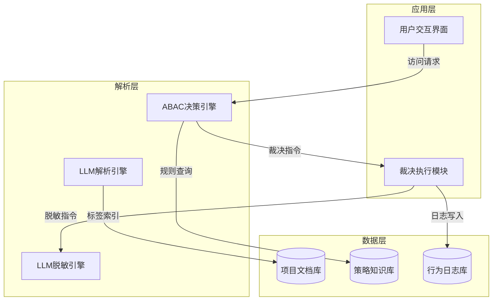
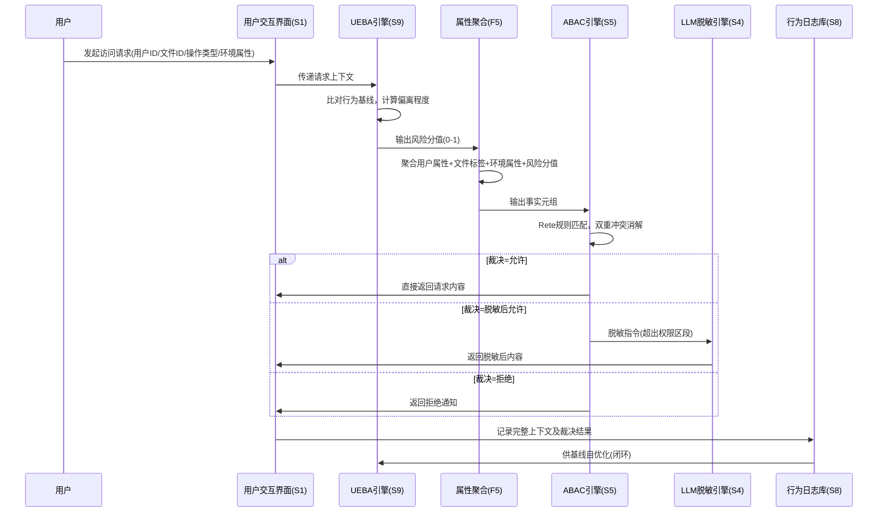
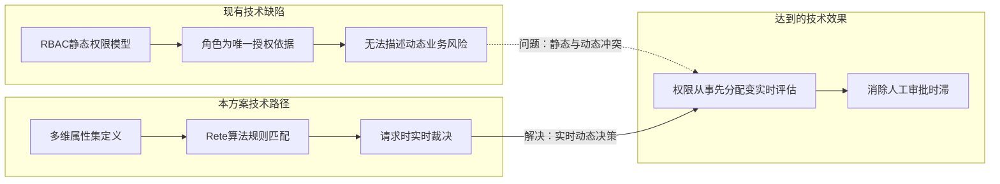

# MBSE 统一五层建模方法

> 本文件为 `MBSE 视图` 全模式 通用的 R/F/S/B/E 五层建模框架。所有 Mode 均使用此五层模型，仅在建模深度、追溯方向和证据严格度上分化。具体差异参见各 mode 工作流文件（`references/modes/mode-*.md`）。

## 五层定义

当任务需要更严格的 MBSE 语义时，将 `sysml-lite-mapping.md` 与本文件配合使用。本文件定义面向专利的统一五层工作流程；SysML-lite 参考文件定义分配、接口、行为选择和验证边界。

### 需求视角（Requirement）

**定义**：技术方案所要解决的技术问题、能力目标、工程约束或可验收的性能目标。需求视角回答“为什么需要该系统/方案”和“需要满足什么约束”，不直接等同于技术效果。

**建模要点**：
- 区分**核心需求**（方案主要解决的技术问题或必须满足的能力）和**衍生需求**（附带的优化目标或约束）
- 引用交底书中明确记载的技术问题段落
- 若交底书未明确表述技术问题，从背景技术或效果描述中间接推断
- 需求应具体化，避免"提高效率"等模糊表述，应尽量具体为"在XX条件下提高XX性能"
- 将技术效果单独记录为 `E` 节点。若技术效果仅是代理人的分析推断，必须标注推断依据或设为 `[Q]` 待发明人确认

**常见问题**：
- 发明人可能将"目的"（商业目的）与"技术问题"混淆，需甄别
- 多个需求之间可能存在层次关系（主需求→子需求）

### 功能视角（Function）

**定义**：技术方案为满足需求而规定的、实现方式相对中立的技术变换。功能不是模块名称，而是：

```text
F = <SystemBoundary, Input, Transformation, Output, PreconditionOrTrigger>
```

`Output`即`F.Output`，表示功能规格要求的直接输出，不构成独立模型层，也不当然等于E。

**建模要点**：
- 将技术方案分解为可独立识别的技术变换
- 每个F记录系统边界、输入、动作和直接输出，必要时记录前提或触发
- 标注功能模块之间的交互关系（数据流、控制流、调用关系）
- 若交底书已有模块化描述，直接引用；若无，基于技术方案合理抽象

**功能分解粒度**：
- 一级功能：对应核心技术方案的主要功能
- 二级功能：一级功能的子功能（在复杂方案中展开）
- 避免过度分解：每个功能模块应能在结构视角找到对应实现

### 结构视角（Structure）

**定义**：实现各功能的物理或逻辑结构特征，包括组件、连接关系、空间布局。

**建模要点**：
- **硬件结构**：组件名称、组件之间的物理/电性连接、空间位置关系
- **软件结构**：模块/类/函数、调用关系、数据依赖、层级架构
- **数据结构**：数据格式、字段定义、组织方式
- **网络结构**：节点、链路、拓扑、协议层次

**注意事项**：
- 区分"必要结构"（解决技术问题所必需）和"可选结构"（锦上添花）
- 关注结构之间的"连接关系"，连接方式本身可能是创新点
- 若交底书中结构描述使用上位概念（如"处理器"），保留上位概念同时标注下位示例

### 行为视角（Behavior）

**定义**：技术方案的工作流程、执行时序、状态转换及条件判断。

**建模要点**：
- **正常流程**：标准操作步骤及其先后顺序
- **时序关系**：并行还是串行，同步还是异步
- **状态转换**：系统的状态定义及转换条件
- **条件判断**：分支逻辑、循环逻辑
- **异常处理**：错误处理流程（如有描述）

**行为建模方式**：
- 流程式：适用于步骤明确的方案（步骤1→步骤2→步骤3）
- 状态机式：适用于有明确状态和转换的方案（状态A→[条件X]→状态B）
- 时序式：适用于强调时间顺序的并发方案

### 效果视角（Effect）

**定义**：具体S/B/关系及输出状态在确定条件下，对技术对象或技术属性产生的进一步技术后果：

```text
E = <AffectedObject, AffectedAttribute, Consequence, ApplicableCondition,
     CausalPath, Evidence, EffectType, ComparisonBaseline?>
```

`EffectType=absolute`记录绝对技术后果，不强制设置比较基线；`EffectType=comparative`记录比较型E，必须同时记录比较基线、差异方向和适用范围。E不是F名称或OutputState的换词表达。

**建模要点**：
- 从`STATE.OutputState`继续追问受影响对象、受影响属性及进一步后果
- 回指具体S/B/关系/CV因果路径及原始证据
- 定量或比较结论必须绑定共同条件、测量口径和比较基线
- 无法说明进一步技术后果时，将陈述移入`F.Output`或标`[Q]`

## 追溯链建立方法

### 追溯链规则

```
需求(R) → 功能(F) → 结构(S) → 行为(B/STATE) → OutputState → 效果(E)
```

**建立步骤**：
1. 从需求出发："为了解决 R1，需要哪些功能？" → 确定 F
2. 功能到结构："功能 F1 由哪些结构实现？" → 确定 S
3. 结构到行为："结构 S1 在运行中如何参与行为流程？" → 确定 B
4. 行为到输出状态："B1执行后形成什么可观察状态，该状态是否对应F.Output？" → 确定`STATE.OutputState`
5. 输出状态到效果："该输出状态进一步改变了哪个技术对象的何种属性，在什么条件下成立且证据为何？" → 确定E

**完整性检查**：
- 每个需求是否至少有一条追溯链到达效果或待确认效果 `[Q]`？
- 每个结构特征是否能在追溯链中找到功能依据？
- 每条追溯链是否在交底书中有文本支持？
- 每个F是否具有输入、变换和直接输出，并由S/B实现？
- 每个E是否具有受影响对象、属性、后果、条件和因果证据，而不是重复F或OutputState？

### 追溯链断裂识别

在建模过程中，若发现以下情况，标注为"追溯链断裂"：
- 某个需求没有对应的功能（需求悬空）
- 某个功能没有对应的结构实现（功能未落地）
- 某个结构在行为流程中未被提及（结构闲置）
- 行为没有形成与F.Output对应的输出状态（功能实现缺失）
- 输出状态没有产生非同义反复且有依据的技术后果（效果缺失）

追溯链断裂可能是交底书信息缺失的信号，需向发明人确认。

## 领域适配指南

### 机械/机电领域

- **需求视角**：关注力学性能、精度、效率、可靠性
- **功能视角**：按机构功能分解（传动、支撑、定位、检测等）
- **结构视角**：零件、部件、装配关系、运动副、接触界面、几何基准、材料
- **行为视角**：运动流程、加工步骤、时序控制、力的施加位置、传力路径、导向/约束反力
- **证据边界**：按 `unified-evidence-rules.md` 和 `domains/mechanical.md` 对每个关键关系标记证据标签；先建立单文件模型，再做文件间要素对应

### 电子/通信领域

- **需求视角**：信号质量、带宽、功耗、抗干扰
- **功能视角**：按电路功能分解（放大、滤波、调制、编码等）
- **结构视角**：电路模块、芯片、接口、连接线
- **行为视角**：信号处理流程、协议交互时序、状态机

### 软件/算法领域

- **需求视角**：计算效率、准确率、扩展性、用户体验
- **功能视角**：按软件模块或算法步骤分解
- **结构视角**：模块/类/函数、数据表、API 接口、系统架构
- **行为视角**：算法执行流程、用户交互流程、事件响应流程

### 化学/材料领域

- **需求视角**：纯度、产率、性能指标、环保性
- **功能视角**：按反应阶段或材料功能分解
- **结构视角**：组分、配比、分子结构、晶体结构、设备组成
- **行为视角**：反应流程、制备步骤、条件控制流程

## 建模示例

### 示例：智能温控散热系统（机械+电子混合）

**需求视角**：
- R1：在狭小空间内满足散热能力需求（交底书第[2]段）
- R2：降低散热系统运行噪声（交底书第[3]段）

**功能视角**：
- F1（实现R1）：引导气流均匀通过散热区域
- F2（实现R1/R2）：根据温度自适应调节散热功率
- F3（实现R2）：吸收风扇产生的噪声

**结构视角**：
- S1（实现F1）：导流板，设置在散热片上游，与散热片呈30°夹角
- S2（实现F2）：温度传感器 + 变频控制器 + 散热风扇
- S3（实现F3）：消音棉层，设置在风扇出风口处

**行为视角**：
- B1（涉及S1-S2）：温度传感器检测→变频控制器判断→先启动导流板至工作位置→再启动散热风扇→根据温度调节转速
- B2（涉及S3）：风扇运转产生噪声→消音棉层吸收中高频噪声

**追溯链**：
- R1 → F1 → S1（导流板） → B1（先导流后散热） → E1：散热效率提高；若交底书未给出测试数据，标注为 `[Q] 待确认提升幅度`
- R1+R2 → F2（输入温度信号，经阈值判定输出目标转速指令） → S2（传感器+控制器+风扇） → B1（按指令调节风扇转速） → OutputState（风扇达到相应转速状态） → E2：在相应空间与热负载条件下改善温升或功耗状态
- R2 → F3 → S3（消音棉） → B2（噪声吸收） → E3：运行噪声降低；若交底书未给出测试数据，标注为 `[Q] 待确认降噪幅度`

## 派生视图：技术模型到权利要求和证据

document-model-2026.2 要求接口、约束、场景和双向追溯均显式给出状态。已有来源时建立具体对象；材料不足时使用 Q 占位并记录缺口；确实不适用或输入阻断时使用对应状态和理由。无说明的空数组不表示完成。

R/F/S/B/E 是本框架唯一的核心技术层。为了服务专利代理工作流，可以从五层模型派生以下视图，但不得把它们解释为新的模型层：

1. **参数与约束视图**：从 R、S、B、E 提取数值范围、阈值、配比、时序、几何和逻辑约束；用于对照和审计，不替代 R 或 E。
2. **权利要求语义视图**：以 `CHAIN → PU/PST/CTX → ClaimVersion → ClaimPath/DepPath → ClaimSpan → CF/REL/CT/INT` 表达权利要求组合、依赖路径和模型对应，不负责生成最终文字。
3. **证据与来源视图**：以 `DOC/EV/SupportLink` 记录原文定位、来源性质、匹配依据和人工审核，不把相似度当作事实确认。
4. **版本与决定视图**：在案件进入补正或答审时，以 `ClaimVersion/AnalysisSnapshot/DecisionTrail` 表示版本传播和决定回写；无此场景时不强制创建。

### 权利要求特征原子

每一个 `ClaimSpan` 或 `CF` 至少保留：对象（`object`）、属性（`property`）、关系（`relation`）、动作（`action`）、条件（`condition`）、顺序（`sequence`）、参数（`parameter`）、原文位置（`source_span`）、事实状态（`fact_status`）和纳入状态（`inclusion_status`）。拆解时不得只保留关键词而删除关系、条件、顺序或组合语境。

### 组合语义规则

单个特征分别与不同文献匹配，不等于完整权利要求组合已被单一文献公开。新颖性评价必须保持同一文献、全部必要特征、关系、条件和顺序的完整网络；创造性评价也必须另行核验组合动机、接口兼容性和合理成功预期。检索排名、语义相似度、ROUGE、BERTScore 或模型置信度只能用于候选发现。

### SysML 操作关系的工作流映射

`satisfy`、`allocate`、`flow`、`refine`、`verify` 和 `trace` 可分别用于表达需求满足、功能—结构分配、接口/数据流、技术细化、效果验证和跨对象追溯。该映射是操作性工作流语义，不主张 SysML 关系与中国专利法概念在法律上完全等价。

## 可视化建模输出规范

本 内部视图 在阶段一强制输出 Mermaid 可视化图表，以辅助技术方案的直观理解。以下为各视角图表的建模规范。

### 结构视角图表（系统架构图）

**使用语法**：`graph TD` 或 `graph LR`，配合 `subgraph` 分层。

**建模要点**：
- 按系统层次划分子图（如应用层、解析层、数据层、分析层）
- 每个结构模块用方框 `[模块名]` 表示
- 模块间的数据流/控制流用 `-->|标签|` 标注
- 数据库/存储用 `[(存储名)]` 表示
- 外部实体用 `{{外部实体}}` 表示

**示例**：


### 行为视角图表（时序图）

**使用语法**：`sequenceDiagram`。

**建模要点**：
- 每个关键结构模块作为一个 `participant`
- 使用 `participant 别名 as 显示名称` 自定义显示名
- 消息传递用 `->>` 或 `-->>` 标注内容和数据格式
- 使用 `alt/else/end` 标注分支逻辑（如裁决结果分支）
- 使用 `loop/end` 标注循环流程
- 使用 `Note over 参与者: 备注` 添加关键说明

**示例**：


### 追溯链图表（端到端链路图）

**使用语法**：`flowchart LR` 或 `flowchart TD`。

**建模要点**：
- 展示完整的 `R → F → S → B → OutputState → E` 链条
- 多条追溯链可并列展示，或用不同颜色区分
- 核心追溯链（覆盖独立权利要求必备特征）用粗线或高亮标注
- 跨视角协同创新点用虚线连接标注

**示例**：
```mermaid
flowchart LR
    subgraph 追溯链1：内容片段建模
        R1[需求：区分不同控制对象] --> F1[功能：将输入文本变换为带标签片段]
        F1 --> S1[结构S3：LLM解析引擎]
        S1 --> B1[行为：解析并标记文本片段]
        B1 --> OS1[输出状态：带标签片段集合]
        OS1 --> E1[效果：降低无关片段随受控片段一并处理的范围]
    end
    subgraph 追溯链2：上下文裁决
        R2[需求：避免不满足当前条件的内容被返回] --> F2[功能：将请求上下文变换为访问决定]
        F2 --> S2[结构S5：ABAC引擎]
        S2 --> B2[行为：读取属性并执行规则]
        B2 --> OS2[输出状态：允许、遮蔽或拒绝决定]
        OS2 --> E2[效果：减少不满足当前上下文条件的内容被返回]
    end
    subgraph 追溯链3：风险输入生成
        R3[需求：使异常行为进入访问控制输入] --> F3[功能：将行为记录变换为风险状态]
        F3 --> S3[结构S9：UEBA引擎]
        S3 --> B3[行为：计算行为偏离程度]
        B3 --> OS3[输出状态：请求主体的风险状态]
        OS3 --> E3[效果：减少高风险请求沿用普通风险状态的情形]
    end
    OS1 -.->|提供片段对象| B2
    OS3 -.->|提供风险属性| B2
```

### 创新点图解（问题→方案→效果）

**使用语法**：`flowchart LR` 或 `flowchart TD`，配合 `subgraph` 分区。

**建模要点**：
- 左侧/上方 subgraph 为"现有技术问题"（红色标注缺陷）
- 中间 subgraph 为"本方案解决路径"（蓝色标注技术步骤）
- 右侧/下方 subgraph 为"技术效果"（绿色标注效果）
- 用虚线 `-.->` 连接现有技术问题到效果，标注"问题"
- 用实线 `-->` 连接方案路径到效果，标注"解决"

**示例**：


### 可视化输出注意事项

1. **图表简洁性**：每个图表控制在 10-15 个节点以内，过于复杂的系统拆分为多个子图
2. **命名一致性**：Mermaid图表中的模块名与四视角文本描述中的编号（S1/S2/F1等）保持一致
3. **可追溯性**：图表中的每个节点应在文本描述中能找到对应定义
4. **多方案对比**：若交底书提供替代方案（如LLM解析 vs 规则词典+正则），用不同子图并列展示
