# Mermaid 可视化图表模板库

本文件为 `MBSE 视图` 内部视图 提供 Mermaid 语法模板，用于生成四视角系统模型的可视化图表。

每个模板包含：语法说明、建模要点、完整示例。

---

## 模板1：结构视角 - 系统架构图（graph TD）

**适用场景**：展示系统的分层模块架构、组件组成及数据流/控制流关系。

**语法**：`graph TD`（Top-Down）或 `graph LR`（Left-Right），配合 `subgraph` 分层。

**建模要点**：
- 按系统层次划分子图（如应用层、解析层、数据层、分析层）
- 每个结构模块用方框 `[模块名]` 表示
- 模块间的数据流/控制流用 `-->|标签|` 标注
- 数据库/存储用 `[(存储名)]` 圆柱体表示
- 外部实体/用户用 `{{外部实体}}` 表示
- 决策点用 `{决策条件}` 菱形表示（可选）

**通用模板**：

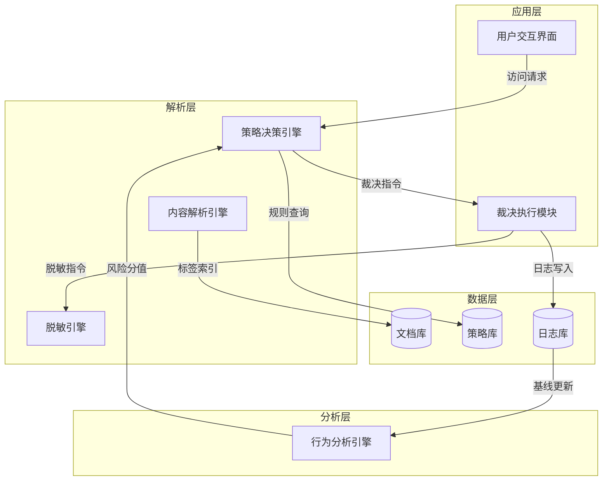

**变体 - 软件系统分层架构**：

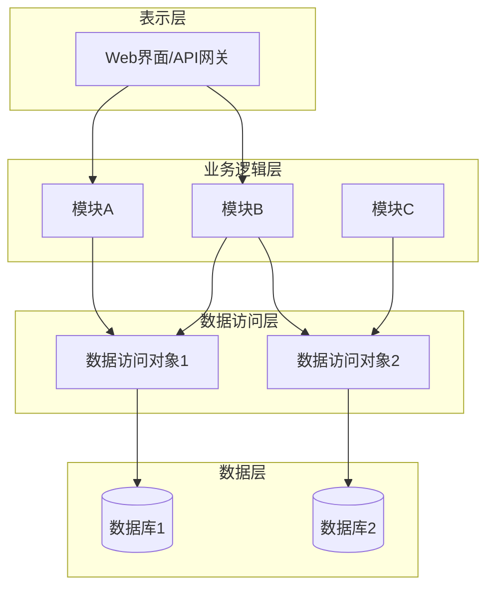

**变体 - 包含外部实体的系统架构**：

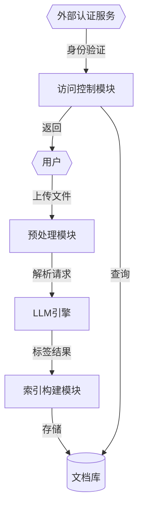

---

## 模板2：行为视角 - 核心流程时序图（sequenceDiagram）

**适用场景**：展示系统运行时各模块间的交互时序、消息传递及分支逻辑。

**语法**：`sequenceDiagram`，配合 `alt/else/end`、`loop/end`、`opt/end`。

**建模要点**：
- 每个关键结构模块作为一个 `participant`
- 使用 `participant 别名 as 显示名称` 自定义显示名（可含编号）
- 消息传递用 `->>`（实线箭头）或 `-->>`（虚线箭头）
- 用 `alt/else/end` 标注分支逻辑（如裁决结果分支）
- 用 `loop/end` 标注循环流程
- 用 `opt/end` 标注可选流程
- 用 `Note over 参与者: 备注` 或 `Note right of 参与者: 备注` 添加说明
- 用 `activate/deactivate` 标注生命周期（可选）

**通用模板 - 请求裁决流程**：

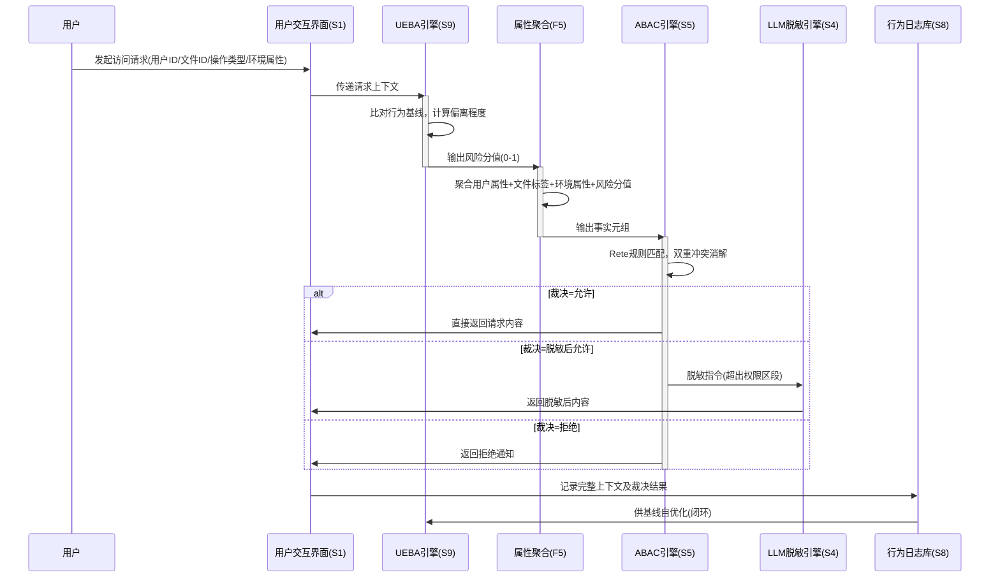

**变体 - 文件入库预处理流程**：

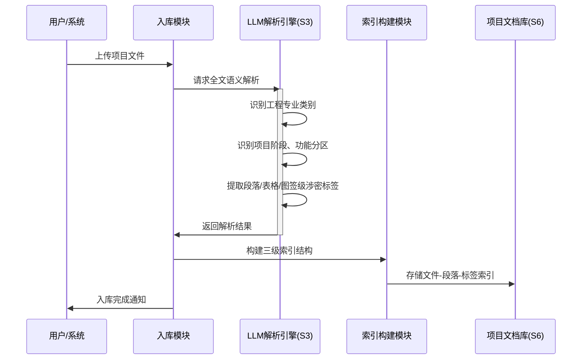

**变体 - 包含循环的后台优化流程**：

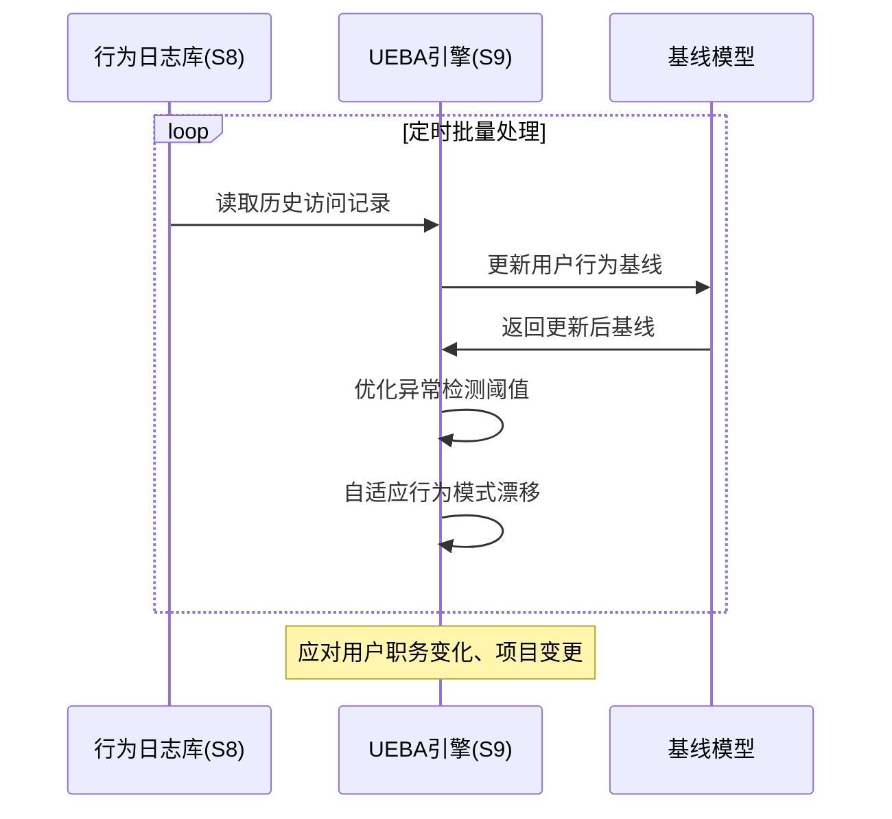

---

## 模板3：创新点 - 技术方案图解（flowchart LR + subgraph）

**适用场景**：对比展示"现有技术问题 → 本方案解决路径 → 技术效果"的完整链路。

**语法**：`flowchart LR`（横向）或 `flowchart TD`（纵向），配合 `subgraph` 分区。

**建模要点**：
- 左侧/上方 subgraph：`subgraph 现有技术问题` — 用红色/虚线标注缺陷
- 中间 subgraph：`subgraph 本方案解决路径` — 用蓝色/实线标注技术步骤
- 右侧/下方 subgraph：`subgraph 技术效果` — 用绿色标注效果
- 用虚线 `-.->` 连接现有技术问题到效果，标注"问题/缺陷"
- 用实线 `-->` 连接方案路径到效果，标注"解决/实现"
- 步骤用 `A[步骤名]` 方框，决策用 `B{判断条件}` 菱形

**通用模板 - 问题方案效果对比**：

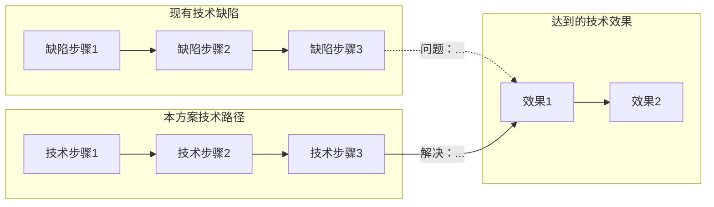

**示例 - 创新点1：LLM语义解析与三级索引**：

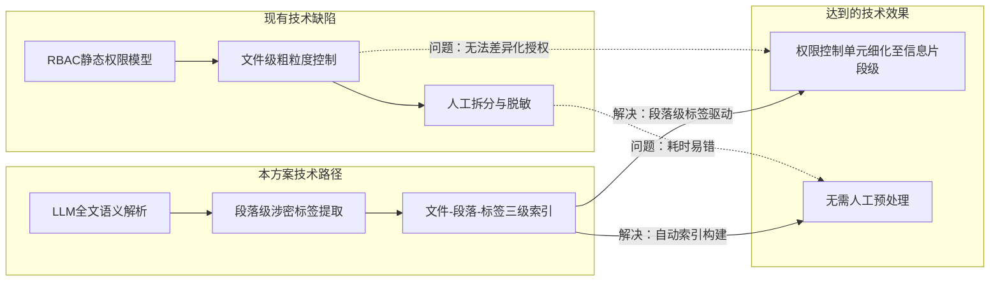

**示例 - 创新点2：ABAC动态访问控制**：

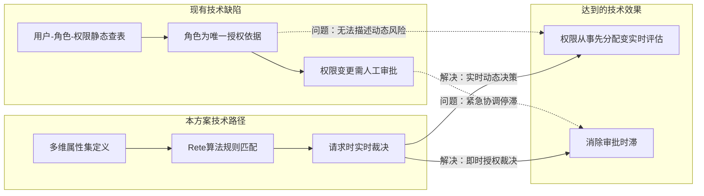

**变体 - 多方案对比（本方案 vs 替代方案）**：

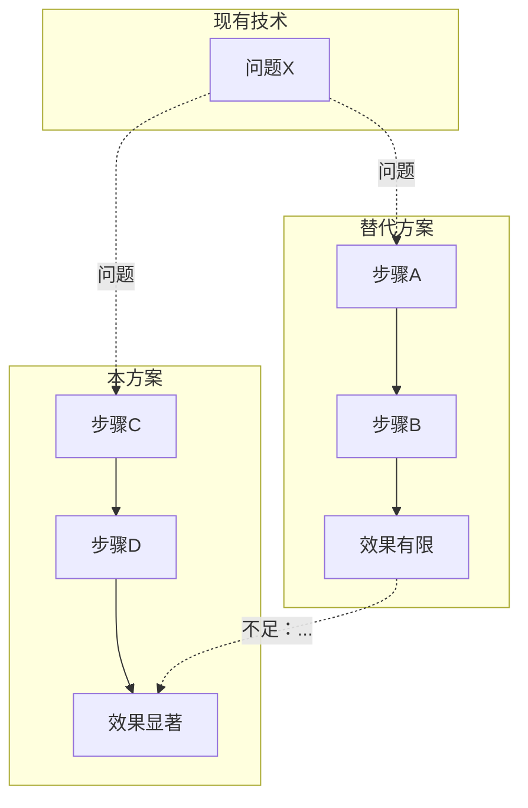

---

## 模板4：追溯链 - 端到端链路图（flowchart LR）

**适用场景**：展示从需求到效果的完整追溯链，多条追溯链并列展示。

**语法**：`flowchart LR` 或 `flowchart TD`。

**建模要点**：
- 展示完整的 R → F → S → B → 效果 链条
- 多条追溯链用多个 `subgraph` 并列展示
- 核心追溯链（覆盖独立权利要求必备特征）可标注为"核心"
- 跨视角协同创新点用虚线连接标注
- 用不同颜色或标注区分核心链与辅助链（通过文字标注）

**通用模板**：

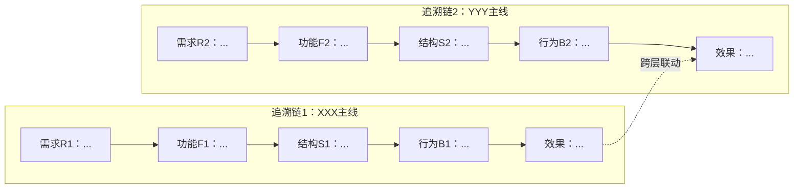

**示例 - 三条技术链及其协同关系**：

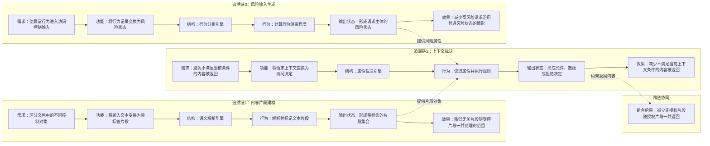

**变体 - 含分支条件的追溯链**：

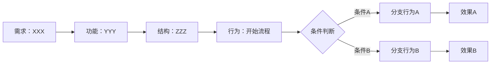

---

## 模板使用速查表

| 视角/场景 | 推荐语法 | 推荐模板 | 关键元素 |
|----------|---------|---------|---------|
| 结构视角（系统架构） | `graph TD` + `subgraph` | 模板1 | 模块、分层、数据流 |
| 行为视角（运行时序） | `sequenceDiagram` | 模板2 | participant、消息、alt分支 |
| 创新点（问题→方案→效果） | `flowchart LR` + `subgraph` | 模板3 | 现有技术/方案/效果三分区 |
| 追溯链（端到端链路） | `flowchart LR` + `subgraph` | 模板4 | R→F→S→B→效果链条 |
| 多方案对比 | `flowchart TD` + `subgraph` | 模板3变体 | 并列子图对比 |
| 含分支的流程 | `flowchart LR` + `{条件}` | 模板4变体 | 菱形决策节点 |
| 后台循环流程 | `sequenceDiagram` + `loop` | 模板2变体 | loop/end |

---

## Mermaid 语法限制与注意事项

1. **节点命名**：避免中文特殊字符（如顿号、书名号），用方括号 `[...]` 包裹中文节点名
2. **子图嵌套**：Mermaid 支持子图嵌套，但建议不超过两层以保证可读性
3. **箭头标注**：`-->|标签|` 中的标签不宜过长，超过8个中文字建议拆分为两个节点
4. **图表大小**：每个图表控制在 15 个节点以内，超过则拆分为多个图表或简化
5. **颜色支持**：Mermaid 支持 `classDef` 定义样式，但部分渲染器不支持，建议以结构清晰为主，不依赖颜色
6. **兼容性**：使用标准 Mermaid 语法，避免使用实验性功能，确保在大多数 Markdown 渲染器和工具中可正常显示
