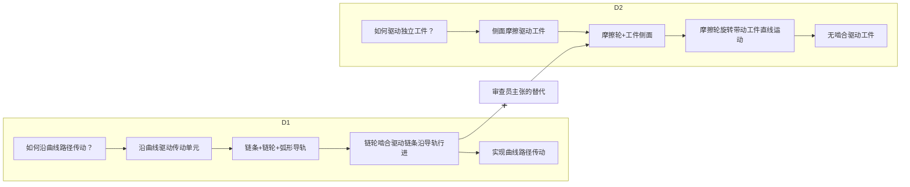

# 阶段三：追溯链与技术启示分析

> **理论基础**：本阶段的方法论建立在 `references/mbse-novelty-inventive-step-mapping.md` 的理论框架之上。该文件定义了追溯链融合的六种失败模式、融合链覆盖权利要求的四种覆盖缺口，以及从 MBSE 论证到法律文书的转换规则。执行本阶段分析时，应始终以该理论框架为判断依据。

## 目的

基于阶段一的 MBSE 追溯链和阶段二的事实核实结果，从技术层面分析审查员主张的对比文件组合路径是否可行——即对比文件之间是否具有结合的可能性和技术启示。本阶段的输出直接服务于阶段四的创造性论证撰写。

## 核心原则

1. **链完整性原则**：组合后的追溯链是否闭合是工程分析问题。已核验的断裂可支持“存在适配障碍”或“缺少结合启示”，但不得脱离文献原文、技术常识和审查意见的具体组合理由直接作法律结论。
2. **不破坏原则**：组合不得破坏任一对比文件原有的工作原理或设计目的。如果组合导致对比文件 A 无法实现其原有功能，则该组合不具备技术启示。
3. **接口兼容原则**：组合需要在结构、尺寸、运动、受力层面可对接。如果存在无法调和的接口冲突，则组合不具备可行性。
4. **证据驱动原则**：所有关于兼容性、冲突、断裂的判断必须基于阶段一的 MBSE 模型和阶段二核实过的原文证据，不得凭空推断。
5. **可允许变换原则**：给出“接口不兼容”结论前，必须明确记录已检验的常规尺寸、形状、材料、参数或软件适配，以及哪一步会改变工作原理、超出文献教导或缺少合理成功预期。

6. **路径对象原则**：每条组合或修改路线必须登记为 `CombinationPath`，而非只写“D1+D2”。路径要能按中间状态重新播放，并区分“工程上可设计”与“现有技术能够到达”。

## 分析步骤

### 步骤一：提取审查员的组合逻辑

从审查意见中提取审查员主张的组合路径：

```markdown
| 组合编号 | 组合方式 | 审查员声称的各文件作用 | 审查员声称的技术启示 |
|---------|---------|---------------------|-------------------|
| C-01 | D1 + D2 | D1 为最接近现有技术，公开了基础结构；D2 公开了摩擦驱动方式 | D2 给出了以摩擦方式替代齿轮方式驱动传动件的技术启示 |
```

### 步骤二：在 MBSE 模型中定位对应节点

将审查员引用的每项特征映射到阶段一建立的 MBSE 节点：

```markdown
| 审查员引用 | 来源文件 | 对应 MBSE 节点 | 节点描述 |
|-----------|---------|--------------|---------|
| "D1 的链条传动结构" | D1 | D1.S2（链条+链轮） | 短节距链条，通过链轮啮合驱动 |
| "D1 的内圆弧轨道" | D1 | D1.S1（弧形导轨） | 链条沿弧形导轨行进 |
| "D2 的摩擦驱动" | D2 | D2.S3（摩擦轮+工件侧面） | 摩擦轮接触工件侧面驱动工件直线运动 |
```

### 步骤三：分析追溯链兼容性（六种融合失败模式）

对审查员主张的组合，根据 `mbse-novelty-inventive-step-mapping.md` §2.3 定义的六种融合失败模式，逐项检查追溯链在组合后是否保持完整。每项观察必须记录原文证据、推断前提和可转化的审查语言；未核验的观察标记为 `Q`。

先建立“可允许变换表”：

| 变换类型 | 已检验的常规适配 | 是否保持主干工作原理 | 文献教导/常识证据 | 结论 |
|---|---|---|---|---|
| 尺寸/形状/材料/参数/接口适配 | 具体变换 | yes/no/Q | EV 或原文位置 | 允许/不允许/Q |

只有在常规适配不能闭合追溯链，或会引入未被教导的二次设计时，才可将其作为融合失败论据。

#### 3.0 `CombinationPath` 最小记录

```markdown
| 字段 | 要求 |
|---|---|
| path_id / claim_version_id | 与问题注册表及活动权利要求版本稳定绑定 |
| D0 / Dk | 起点文献、补充文献及各自承担的技术作用 |
| operations | 节点加入、替换、关系重连、行为重排的顺序和中间状态 |
| Ω / interface / parameters | 允许变换、接口和参数/环境共同约束 |
| teaching / expected_success | 启示来源与合理成功预期的证据位置 |
| breakpoints / status | 断点、`FusionFeasible` 工程状态及 `D/I/Q/X` 依据 |
```

正向闭合条件为：`SourceClosed ∧ NodeSemanticPreserved ∧ InterfaceContinuous ∧ BehaviorContinuous ∧ ConstraintsJointlySatisfiable ∧ CausalClosed(S/B→E)`。反向断裂检查节点身份、接口转换、功能分配、时序/状态、效果归属和实际问题是否改变。该状态只表示技术事实分析结果，不直接等同法律结论。

#### 3.1 模式一：节点同一性冲突（S 层）

检查组合涉及的 S 节点之间是否存在互斥属性——即两篇对比文件指向同一物理位置或功能角色，但赋予了不可共存的结构属性：

| 节点对 | 是否占同一功能槽位？ | 属性是否互斥？ | 冲突描述 |
|--------|------------------|-------------|---------|
| D1.S2（链条+链轮啮合） vs D2.S3（摩擦接触驱动） | ✅ 同为"驱动接口" | ✅ 啮合齿形 vs 平直摩擦面不可共存 | 同一被驱动对象无法同时具有啮合齿形和平直摩擦面 |

#### 3.2 模式二：接口断裂（S→B 层）

检查 D2 被嫁接节点的输出类型是否与 D1 主干节点的输入类型匹配——即行为链在接口处是否发生断裂：

| D1 行为终点（输出） | D2 功能起点（所需输入） | 是否匹配？ | 断裂描述 |
|-------------------|---------------------|----------|---------|
| D1.B1：链节绕链轮做圆周啮合运动（输出周期性离散运动） | D2.F1'：对具有连续平直侧面的工件施加摩擦力（需要连续面接触） | ❌ 不匹配 | 链节无法提供连续平直侧面作为摩擦接触面 |

#### 3.3 模式三：功能层互斥（F 层）

检查两篇文件在同一功能槽位上是否提出了互斥的实现方式：

| 功能槽位 | D1 实现 | D2 实现 | 是否互斥？ | 互斥原因 |
|---------|--------|--------|----------|---------|
| 驱动传动单元 | 齿轮啮合传动（齿形啮合，节距匹配） | 摩擦传动（面接触，不依赖节距） | ✅ 互斥 | 同一驱动接口不能同时使用啮合和摩擦两种物理机制 |

#### 3.4 模式四：行为时序冲突（B 层）

检查 D1 和 D2 的行为在时间维度上是否存在不可调和的矛盾：

| D1 行为序列 | D2 嫁接要求 | 是否冲突？ | 时序冲突描述 |
|------------|-----------|----------|------------|
| 链条连续行进 → 链节经过链轮 → 啮合传力 | 链节需在接触区域短暂停留以建立摩擦接触 | ✅ 冲突 | 连续行进与短暂停留不可兼得 |

#### 3.5 模式五：效果抵消（E 层）

检查融合后 D2 节点的引入是否导致 D1 原有技术效果被削弱或取消：

| D1 原有效果 | 嫁接 D2 后效果 | 是否抵消？ | 说明 |
|-----------|-------------|----------|------|
| E1：精确传动（啮合保证传动比） | 摩擦传动精度低 | ✅ 效果劣化 | 本领域技术人员没有动机进行劣化组合 |

效果论证须另建 `EffectEvidenceCard`（效果证据卡）：区分原申请明示效果、可由结构/行为直接支持的效果、需要实验/仿真/客户确认的效果，并记录比较基准、来源日期和权利要求范围覆盖。仅前两类可进入肯定性论证；第三类标记 `Q`，使用“提供…结构基础”等受限表述或不作为结论前提。

#### 3.6 模式六：问题消解（R 层）

检查 D2 所要解决的技术问题在 D1 体系中是否已经不存在或以不同方式被解决：

| D2 解决的问题 | D1 体系中该问题的状态 | 是否消解？ | 说明 |
|-------------|-------------------|----------|------|
| R2'：如何无啮合驱动独立工件 | D1 的链条体系本身就依赖啮合传动，不存在"避免啮合"的需求 | ✅ 已消解 | 本领域技术人员没有动机在链条体系中引入摩擦驱动来解决一个不存在的问题 |

#### 3.7 接口兼容性补充分析（按 mode 执行）

在以上六种模式分析的基础上，按当前 mode 补充对应维度的兼容性检查。

**Mechanical 模式**：

| 接口维度 | D1 的要求 | D2 的要求 | 是否兼容？ | 说明 |
|---------|----------|----------|----------|------|
| 驱动界面 | 齿轮齿啮合（点/线接触，节距匹配） | 摩擦面接触（面接触，不依赖节距） | ❌ | 对应模式一/三 |
| 被驱动对象尺寸 | 链节尺寸受节距约束 | 工件尺寸不受节距约束 | ❌ | 对应模式二 |
| 运动轨迹 | 沿轨道弯曲行进 | 直线运动 | ⚠️ 需适配 | 对应模式四 |

**Biochemical 模式**：检查反应条件（温度、pH、溶剂、催化剂）兼容性、组分化学相容性（是否发生副反应）、参数范围重叠性。

**Electronic-Communication 模式**：检查数据格式兼容性、协议/接口兼容性、硬件依赖兼容性、时序/同步兼容性。

### 步骤四：融合链覆盖分析（四种覆盖缺口）

即使步骤三的六种模式均未触发（即假定融合在技术上可行），仍需判断融合后的追溯链 C_fused 是否覆盖权利要求的追溯链 C_claim。根据 `mbse-novelty-inventive-step-mapping.md` §3.1，检查以下四种覆盖缺口：

#### 覆盖缺口一：S 节点缺失

| C_claim 的 S 节点 | C_fused 是否有对应？ | 结论 |
|------------------|-------------------|------|
| S₂：第一传动板 + 第二传动板，铰接连接 | D1.S₂'：链条（多节链环，销轴串联）——非板状传动单元 | ❌ 缺失 |
| S₅：皮带外侧壁贴合传动板侧面 | D2.S₅'：皮带表面接触工件侧面——"贴合"≠"接触" | ❌ 缺失 |

#### 覆盖缺口二：S 节点关系不同

| 关系 | C_claim | C_fused | 是否相同？ |
|------|---------|---------|----------|
| 传动板之间 | 铰接连接 | 销轴串联 | ❌ 铰接允许大角度摆动，销轴串联受节距限制 |
| 皮带与传动单元 | 外侧壁贴合（持续面接触） | 表面接触（可能为点/线接触） | ❌ |

#### 覆盖缺口三：行为路径不同

| 行为 | C_claim | C_fused | 是否相同？ |
|------|---------|---------|----------|
| 驱动方式 | 皮带摩擦驱动传动板侧面 → 板直接受力 | 链轮啮合驱动链条 → 链节通过邻接单元牵引 | ❌ 受力路径不同 |
| 曲线适应 | 滚轮沿内外轨道滚动 → 板单元绕铰接轴转动 | 链节逐个进入弧形导轨 → 链节间相对转动 | ❌ 适应机制不同 |

#### 覆盖缺口四：效果层面不同

| 效果 | C_claim | C_fused | 是否相同？ |
|------|---------|---------|----------|
| 传动单元可做大 | 板状结构不受节距约束 | 链节受节距约束，不能自由放大 | ❌ |

**覆盖分析结论**：☐ 覆盖完整 / ☐ 存在覆盖缺口（列出缺口编号____）

### 步骤五：判断技术启示

基于以上步骤三（融合可行性）和步骤四（覆盖完整性）的分析，对审查员声称的技术启示逐一判断：

```markdown
| 技术启示编号 | 审查员的启示主张 | 融合可行性（步骤三） | 覆盖完整性（步骤四） | 综合结论 | 依据 |
|------------|---------------|-------------------|-------------------|---------|------|
| T-01 | D2 给出了以摩擦方式驱动传动件的技术启示 | ❌ 模式一/二/三成立 | ❌ 缺口一/三/四成立 | ❌ 不成立 | 1) 节点同一性冲突（模式一）；2) 接口断裂（模式二）；3) 功能层互斥（模式三）；4) 融合链不覆盖 S₂/S₅（缺口一） |
```

#### 技术启示判断标准

| 结论 | 条件 |
|------|------|
| ✅ 有证据支持 | 文献与技术常识证据支持结合教导、动机、兼容性及合理成功预期 |
| ⚠️ 需补充核验 | 工程上可能可行，但审查意见遗漏了重要适配条件、动机或证据 |
| ❌ 反驳依据充分 | 已核验证据显示缺少结合启示、存在适配障碍、不能合理预期效果或文献存在相反教导 |

### 步骤六：映射答复类型

将每个断点映射到第五章的答复矩阵：

| 反驳类型 | 主要追溯对象 | 典型处理 |
|---|---|---|
| 事实认定错误 | 文献—特征—证据段落 | 争辩并给出原文对照 |
| 设计事项认定错误 | 区别特征—技术作用 | 争辩或补充效果证据 |
| 缺乏结合动机 | 来源网络—组合操作—TeachingRecord | 争辩 |
| 存在阻碍因素 | 接口、参数、时序、工作原理 | 争辩或修改 |
| 有利/意外效果 | `S/B→E` 因果链—比较基准 | 争辩或补充证据 |

`Could-Would` 仅在上述技术事实已经形成后作为规范边界检查；不得用它代替路径建模、接口审计或效果证明。

## 必须交付物

### 1. 审查员组合路径的追溯链映射图

使用 Mermaid 或表格形式，将审查员主张的组合路径映射到 MBSE 节点：



标注断裂点：用 `--x` 或红色标注无法对接的节点。

### 2. 结合可行性分析表（六种失败模式汇总）

```markdown
| 组合编号 | 模式一：节点冲突 | 模式二：接口断裂 | 模式三：功能互斥 | 模式四：时序冲突 | 模式五：效果抵消 | 模式六：问题消解 | 综合结论 |
|---------|---------------|---------------|---------------|---------------|---------------|---------------|---------|
| C-01 (D1+D2) | ❌ 驱动界面冲突 | ❌ 链节无平直侧面 | ❌ 啮合/摩擦互斥 | — | ⚠️ 精度劣化 | ✅ D1 无"避免啮合"需求 | ❌ 不具可行性 |
```

### 3. 融合链覆盖分析表（四种覆盖缺口汇总）

```markdown
| 组合编号 | 缺口一：S节点缺失 | 缺口二：S关系不同 | 缺口三：行为路径不同 | 缺口四：效果不同 | 覆盖结论 |
|---------|----------------|----------------|-------------------|---------------|---------|
| C-01 (D1+D2) | ❌ S₂（板链）缺失；S₅（贴合关系）缺失 | ❌ 铰接 vs 销轴串联 | ❌ 受力路径不同 | ❌ 节距约束未解除 | ❌ 不覆盖 |
```

### 4. 追溯链分析报告

```markdown
# 追溯链分析报告

## 一、审查员组合路径概述

## 二、各组合路径的追溯链分析
### 组合一：D1 + D2
#### 审查员的组合逻辑
#### MBSE 节点映射
#### 节点冲突分析
#### 追溯链断裂分析
#### 接口兼容性分析
#### 结合可行性结论

## 三、可用于反驳的技术论据汇总
- 断裂点清单
- 冲突节点清单
- 不兼容接口清单

## 四、对审查员其他逻辑路径的分析（如有）
```

## 阶段三完成确认

- [ ] 审查员所有组合路径已提取并编号；
- [ ] 每条组合路径已完成 MBSE 节点映射；
- [ ] 六种融合失败模式已逐项检查（步骤三）；
- [ ] 四种覆盖缺口已逐项检查（步骤四）；
- [ ] 每条技术启示已给出明确结论及依据（步骤五），结论标注了对应的失败模式编号和覆盖缺口编号；
- [ ] 结合可行性分析表（六模式汇总）已完成；
- [ ] 融合链覆盖分析表（四缺口汇总）已完成；
- [ ] 追溯链分析报告已完成；
- [ ] 可用于反驳的技术论据已按失败模式/覆盖缺口分类汇总。
- [ ] 每条“不兼容”论据均记录了已检验的可允许变换和二次设计界限；
- [ ] 每项技术效果均有 `EffectEvidenceCard`，`Q` 效果未作为肯定结论前提。
- [ ] 每条 `CombinationPath` 均记录操作顺序、中间状态、来源、接口/参数条件、TeachingRecord 和断点；
- [ ] 正向闭合与反向断裂均已逐项检查，且 `FusionFeasible` 未被当作法律结论；
- [ ] 断点已映射至五类反驳类型和阶段四的处理动作。

**仅在上述全部确认后，进入阶段四。**

## 补充：反驳类型与融合断点的对应

每条 `CombinationPath` 应在融合断点之外记录主要答复类型：事实认定错误、设计事项认定错误、缺乏结合动机、存在阻碍因素、效果或问题被错误消解。一个争点可以对应多个断点，但必须分别提供来源、接口/参数/时序、效果因果和合理成功预期证据。`FusionFeasible` 只表示工程事实状态；缺少来源闭合或关系保持时，应输出条件性或 `Q`，不得直接写成创造性结论。审查员声称“可以组合”不等于已有文献给出了到达路径。

### 统一创造性答复方法层

无论输入来自中国案件、美国比较法案例还是其他法域材料，阶段三均按同一可回放结构组织：

```text
D0（最接近现有技术）
→ 区别特征分组
→ 技术效果及 R→F→S/B→E 因果链
→ 实际技术问题
→ Dk 的加入/替换/重连/重排操作
→ 接口、行为、约束和参数断点
→ 结合动机、反向教导、合理成功预期
→ 申请人争辩或补正动作
```

每条 `CombinationPath` 至少填写起点文献、补充文献、操作顺序、中间状态、接口/参数条件、`TeachingRecord`、断点、`fusion_feasible` 和证据状态。该方法层可复用不等于不同法域实体规则相同；`jurisdiction` 只作为来源元数据，外部案例结果不得直接写成中国案件的确定性法律事实。
